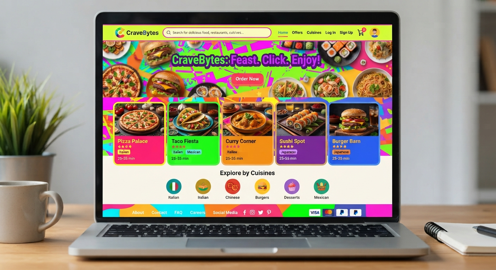
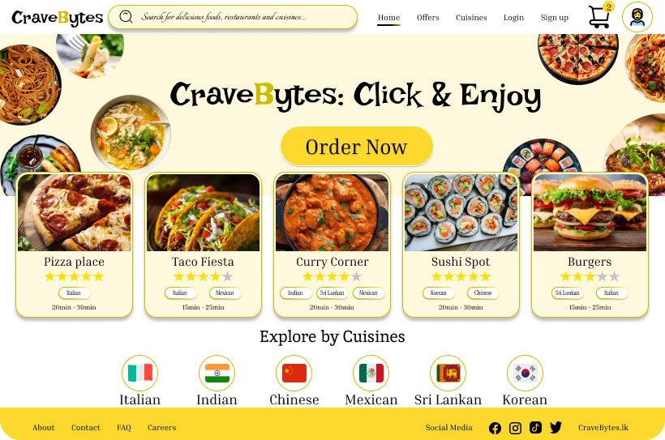

# 🎨 AI vs My Design — Food Delivery UI

A UI/UX design comparison between an **AI-generated food delivery website** and my own **human-designed version**, focusing on **Color Theory, Visual Hierarchy, User Experience, and Design Thinking**.

## 💡 Project Overview

AI can generate a user interface within seconds, but UI/UX design is more than simply creating attractive screens.

> **“Color isn't just a decoration. It's communication.”**

For this project, I compared an AI-generated food delivery interface with my own design to explore how **human design thinking and intentional visual decisions** can influence the user experience.

---

## 🖼️ Design Comparison

### 🤖 AI-Generated Design

The first design was generated using AI.

### 🎨 My Design

I created the second design with a focus on user experience, visual hierarchy, and intentional color choices.

---

## 🎨 Color Theory

One of the main areas I focused on was **Color Theory**.

Colors are not only used to make an interface visually appealing. They can communicate meaning and influence how users understand and interact with a product.

In my design, I considered color to:

* 🎯 Create visual hierarchy
* 👀 Guide users' attention
* 💬 Communicate emotions and meaning
* 📖 Improve readability
* 🏷️ Build visual and brand identity
* 🖱️ Support user interaction
* ⚖️ Create visual balance

The goal was not simply to choose colors that looked good, but to understand **why each color was being used**.

---

## 🤖 AI vs 🧠 Human Design Thinking

| AI-Generated Design                                 | My Design                                |
| --------------------------------------------------- | ---------------------------------------- |
| Quickly generates UI concepts                       | Designed with intentional decisions      |
| Focuses mainly on visual generation                 | Considers user needs and experience      |
| Can create attractive layouts                       | Uses visual hierarchy purposefully       |
| Generates based on given instructions               | Involves human reasoning and creativity  |
| Fast for experimentation                            | Focuses on context and user interaction  |
| Limited understanding of human emotions and context | Uses empathy and human-centered thinking |

---

## 🎯 What I Explored

Through this comparison, I explored:

* Color Theory
* Visual Hierarchy
* UI/UX Design Principles
* User-Centered Design
* Design Thinking
* AI-Assisted Design
* Human Creativity
* Visual Communication

---

## 🛠️ Tools Used

* **Figma**
* **AI Design Tools**
* **Color Theory**
* **UI/UX Design Principles**

---

## 💭 My Takeaway

AI is becoming a powerful tool for designers. It can help generate ideas, explore concepts, and speed up the design process.

However, I believe **design is not only about generating screens**.

> **AI can generate. Humans can understand, empathize, question, and make intentional design decisions.**

This comparison helped me understand the difference between **creating a UI and designing an experience**.

### Can AI replace human design thinking?

**Maybe one day AI will become much more powerful — but for now, I believe great design still needs human reasoning, empathy, creativity, and intention.**

---

## 👩‍💻 Designer

**Shehana Rizmi Lanthra**

UI/UX Design | Product Design | Computer Science

---

⭐ *Designed as a UI/UX learning and experimentation project.*
